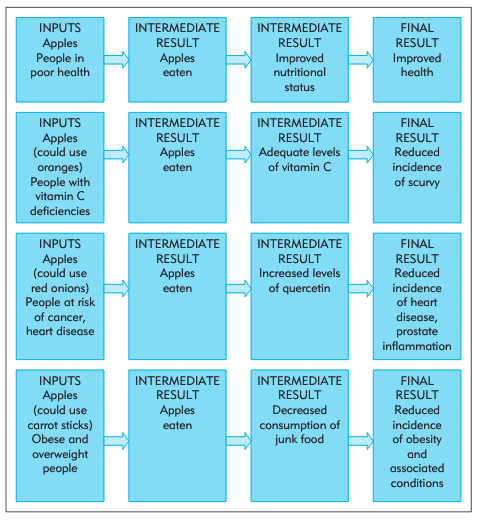

# Developing the intervention

Designing the intervention involves:

-   Developing a program theory
-   Qualitative analysis or groundwork

## Program theory

A program theory refers to a variety of ways of developing a causal modal linking program inputs and activities to a chain of intended or observed outcomes, and then using this model to guide the evaluation [@rogers2000]. It articulates how an intervention is expected to contribute to a chain of results that produce the intended or actual impacts. It can include positive impacts (which are beneficial) and negative impacts (which are detrimental). It can also show the other factors which contribute to producing impacts, such as context and other projects.

Speculating on different possible causal mechanisms through a program theory is useful to provide a conceptual framework to understand to what extent, for whom, and why an intervention does or does not work. It is also helpful to determine which outcomes we should measure. If the program is not successful, having indicators for these intermediate steps helps us understand at which step in the chain the program failed. Although a single evaluation is limited in its scope, program theory makes it easier to combine evidence from a number of studies.

Different types of diagrams can be used to represent a program theory. These are often referred to as logic models, as they show the overall logic of how the intervention is understood to work.

## An apple a day keeps the doctor away — or does it?

Let's look at the program example and discussion from @funnell2011. Suppose we have implemented a program, called An Apple A Day, which involves distributing seven apples a week to each participant with the broad objective of improving health.

### An evaluation without program theory

A representation of this program without program theory would simply show the program followed by the intended outcome as shown in this figure. This figure only shows what goes in and what comes out without information about how things are processed in between. This is just a black box evaluation.

### Logic models showing different possible causal mechanisms

The following figure shows a program theory for An Apple A Day. It displays four different mechanisms that might plausibly explain why the policy works.

### Using program theory to interpret evaluation findings

The table below summarises how an evaluation informed by program theory can distinguish among different types of success and failure. It focuses on the second mechanisms (improved level of Vitamin C) and can be done only if we have collected Vitamin C levels.

## Design and select an intervention

After working through your program theory, you will typically have a shortlist of interventions that you could trial. The purpose of the trial is to differentiate between the effectiveness of those behavioural interventions. Are any of the interventions more effective in improving your outcome of interest? 

An important part of the design and selection of interventions is made through ground and qualitative work.

You need to check whether the theory behind the intervention makes sense on the ground. For example, suppose that you want to improve health outcomes in a low-income countries by providing health worker training. When you visit the health centres as part of your groundwork, you realise that the main issue is health worker absenteeism. It does not make sense to improve training if health workers are not at work. You probably need to go back to your program theory and think about ways to reduce absenteeism.

You can also use qualitative work to refine the design. For example, if you want to convey complex financial information as part of your intervention, you need to make sure that lay people can understand it without too much effort.

Here are some other practical questions you need to ask in selecting interventions for trial.

**First**, you want the choice of interventions to help answer an interesting question. You want to learn something. For example, has the intervention been found effective or ineffective in similar contexts before? Will you learn something new from trying it again? If text message reminders have been found consistently effective in similar scenarios, a test of text messages versus control of no message may not be informative. However, a trial varying the content of the message and the theoretical underpinning of that message might be.

**Second**, you want to select interventions that you can deliver consistently at scale. For the experiment, you want everyone within each group (control and treatments) to receive the same interventions as others in the group. But more importantly, what would happen if your trial was successful? What will it practically look like at scale relative to your perfect world conception of the intervention? If you have found an intervention to be highly effective, but it is not feasible to roll out at scale, your experiment is not useful.

The process of selecting interventions for an applied behavioural science trial is usually conceptually simpler than developing interventions for an academic experiment designed to test a theory. In that case, it is important that there is not a confounding theory that gives an equally plausible rationale for the behaviour observed in the experiment. The experimenter needs to understand the most plausible hypotheses that should be controlled for, which might depend on recent developments in theory. An experiment may only appear good at the time, as subsequent work may expose its theoretical flaws.

But that is not to say that you shouldn't think about the conceptual and theoretical underpinnings of your interventions in an applied behavioural science trial. There will typically be a theoretical basis for your choice of interventions. That basis will help determine what you should measure. It will inform the interpretation of your results. It can provide the foundation for you to take those interventions into other contexts.