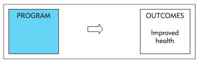
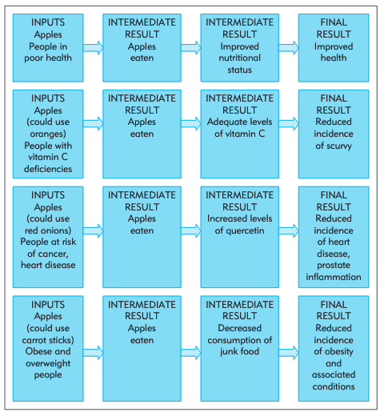

# Program theory

A program theory refers to a variety of ways of developing a causal modal linking program inputs and activities to a chain of intended or observed outcomes, and then using this model to guide the evaluation [@rogers2000]. It articulates how an intervention is expected to contribute to a chain of results that produce the intended or actual impacts. It can include positive impacts (which are beneficial) and negative impacts (which are detrimental). It can also show the other factors which contribute to producing impacts, such as context and other projects.

Speculating on different possible causal mechanisms through a program theory is useful to provide a conceptual framework to understand to what extent, for whom, and why an intervention does or does not work. It is also helpful to determine which outcomes we should measure. If the program is not successful, having indicators for these intermediate steps helps us understand at which step in the chain the program failed. Although a single evaluation is limited in its scope, program theory makes it easier to combine evidence from a number of studies.

Different types of diagrams can be used to represent a program theory. These are often referred to as logic models, as they show the overall logic of how the intervention is understood to work.

## An apple a day keeps the doctor away — or does it?

Let's look at the program example and discussion from @funnell2011. Suppose we have implemented a program, called An Apple A Day, which involves distributing seven apples a week to each participant with the broad objective of improving health.

### An evaluation without program theory

A representation of this program without program theory would simply show the program followed by the intended outcome as shown in the figure below. This figure only shows what goes in and what comes out without information about how things are processed in between. This is just a black box evaluation.

### Logic models showing different possible causal mechanisms

The following figure shows a program theory for An Apple A Day. It displays four different mechanisms that might plausibly explain why the policy works.

The table below summarises how an evaluation informed by program theory can distinguish among different types of success and failure. It focuses on the second mechanisms (improved level of Vitamin C) and can be done only if we have collected Vitamin C levels.

### Using program theory to interpret evaluation findings

| apples delivered | apples eaten | vitamin C levels raised | health outcomes improved | interpretation                                       |
|-----------------|--------------|------------------------|-------------------------|-----------------------------------------------------|
| no              | no           | no                     | no                      | implementation failure                               |
| yes             | no           | no                     | no                      | engagement or adherence failure (first causal link)  |
| yes             | yes          | no                     | no                      | theory failure (early causal link)                   |
| yes             | yes          | yes                    | no                      | theory failure (later causal link)                   |
| yes             | yes          | yes                    | yes                     | consistent with theory                               |
| yes             | yes          | maybe                  | maybe                   | partial theory failure (works in some contexts)      |
| yes             | yes          | no                     | yes                     | theory failure (different causal path)               |

*Diagrams and table adapted from @funnell2011*

::: {.callout-tip}
## Activity

Can you think about other mechanisms through which providing an apple a day to people will improve their health to augment the program theory?
:::

For more information, see @glennerster2013a.
