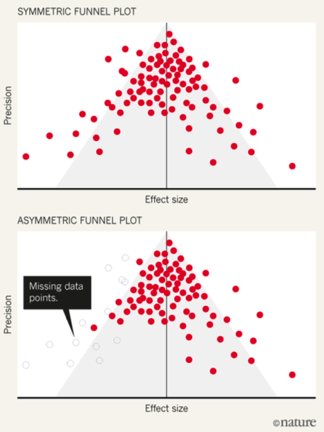

# Publication bias

In 2011, the Journal of Personality and Social Psychology (a big, flagship journal) published a paper by Daryl Bem [-@bem2011] entitled "Feeling the Future: Experimental Evidence of Anomalous Retroactive Influences on Cognition and Affect."

In the paper, Bem described nine experiments. In the first experiment, participants were shown pictures of two curtains side-by-side on a screen. One had a picture behind it, the other a blank wall. The participants were asked to click on the curtain they felt had the picture behind it. They were then shown if they had selected the correct curtain.

Some of the pictures shown to the participants were "erotic". Where there was an erotic picture, participants selected the pictures more often than expected by chance: 53.1% of the time. For non-erotic pictures, the probability of success did not vary significantly from chance. The p-value for selecting the erotic pictures was 0.01, a significant result.

Would Bem's research have been published in a top psychology journal if he had not obtained a statistically significant result? Would the journal waste its resources publishing a paper suggesting people do not have ESP?

This point is the essence of publication bias. Publication bias occurs where the outcome of an experiment influences whether it is published or not.

Studies that find significant effects are more likely to be published. This incentivises those conducting experiments to only write up their positive results. Studies that do not generate statistically significant results end up in the file drawer. Ultimately, the published literature ceases to be a representative sample of the evidence. Instead, it is biased.

## Analysis to identify publication bias

While it is easy to see the incentives that might generate publication bias, measuring publication bias is more difficult and sometimes controversial.

One common way is through the use of a funnel plot, which is used to analyse for publication bias across a literature. The effect sizes of all experiments examining a particular intervention are plotted against the precision of the studies. Precision is usually proxied by study size or the standard error.

A literature in which all experimental results are published should see a spread of results around the effect size, with smaller or less precise studies having more variation around that point. This results in a funnel shape of results, as in the first diagram.

Where there is publication bias, there is often an asymmetry in that the results on one side of the funnel plot (typically the small sample studies that delivered results in the unintended direction) are missing.

*Image from @cressey2017*

Asymmetric funnel plots are not definitive of publication bias, and rest on several assumptions such as a lack of systematic link between size of effect and size of study (which there may be if people use a larger sample because they believe the effect is small).

## Remedying publication bias

A primary method proposed for reducing publication bias is the use of pre-registration. This provides a basis for understanding the full scope of the studies that have been undertaken.

However, this is not a complete remedy as many pre-registered studies are not published and their results not available. That prevents us from obtaining a complete view of the experiments that have been conducted.