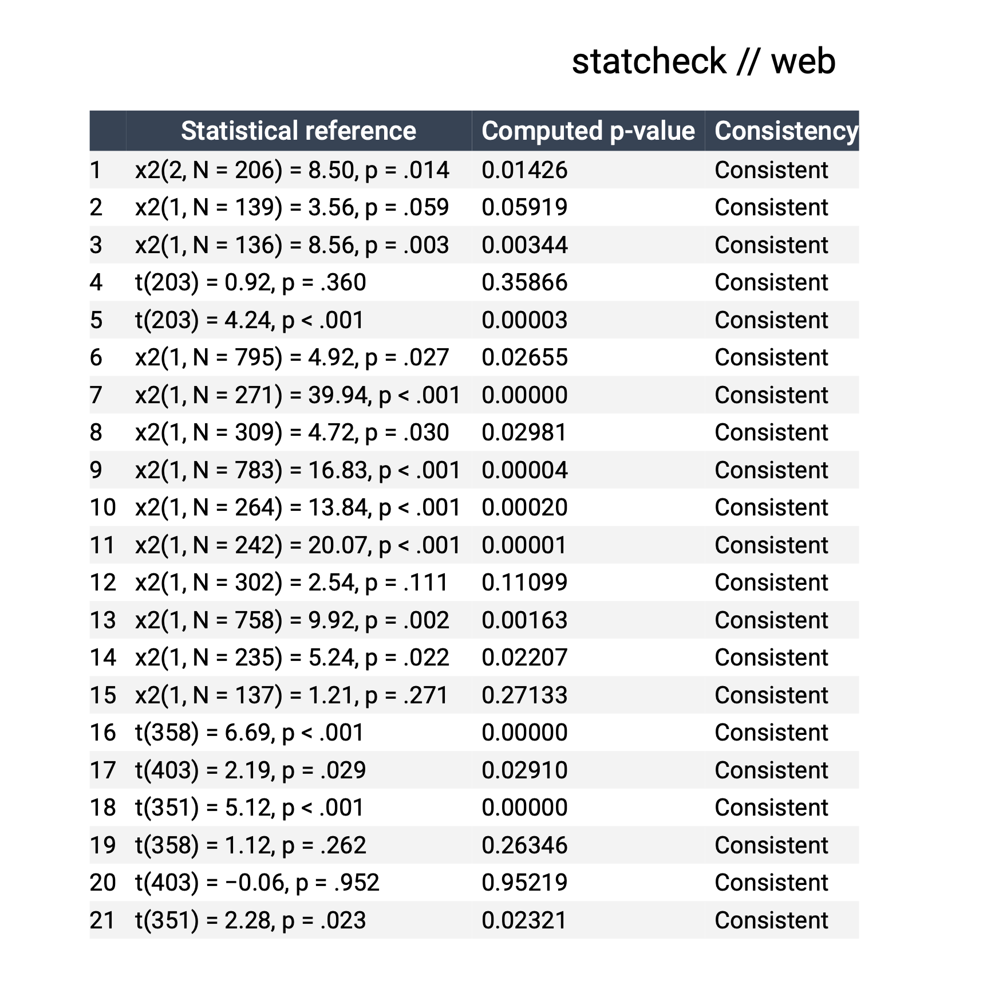

# Replication and reproducibility

**Reproducibility** is the ability of a different analyst to re-perform the same analysis of experimental data.

**Reproducible research** is research that provides the full materials require to reproduce academic research. It includes features such as the code and data that was used and details on the computational environment in which it was examined.

**Replication** is the ability to re-perform the experiment and collect new data. An experiment is said to replicate if it returns a similar result.

The terms reproduction and replication are sometimes used interchangeably, so their precise names don't matter, but the distinct concepts do.

## Reproducibility

Even with the same data, people can come to different conclusions about the hypotheses.

They can transform the data in different ways. They can use different tests for the hypotheses. There are many possible analytic approaches. The result is that experimental data does not in itself provide the conclusion. Absent reproducible research, it is not clear what choices were made and the effect of those choices on the conclusion cannot be examined.

As one dramatic illustration involved an analysis of data to see whether soccer referees are more likely to give red cards to dark-skinned players than to light-skinned players [@silberzahn2018]. Twenty-nine analyst teams were tasked with answering this question. They found effect sizes ranging from 0.89 (dark-skinned players receive fewer) to 2.93 (dark-skinned players receive almost three times as many). Twenty of the 29 teams found a statistically significant positive effect, with the other nine failing to find a statistically significant relationship.

## Statcheck

One way to perform a quick robustness check across a paper is by using [statcheck](https://michelenuijten.shinyapps.io/statcheck-web/). To use statcheck, you upload a pdf, HTML or docx of the paper. Statcheck then extracts details of the tests reported in the paper and checks that the reported numbers are consistent. (An [R package for statcheck](https://cran.r-project.org/web/packages/statcheck/index.html) allows you to run your own statcheck implementation.)

As an example, I uploaded the @dietvorst2015 pdf, but the analysis did not work. I then accessed a HTML download of the paper using the UTS library website. Uploading the HTML version of the paper resulted in the following.

The results appear consistent with the reported tests.

Statcheck does not work on all papers and only checks that the tests are consistent with the reported numbers, but it is a quick way to look for red flags.