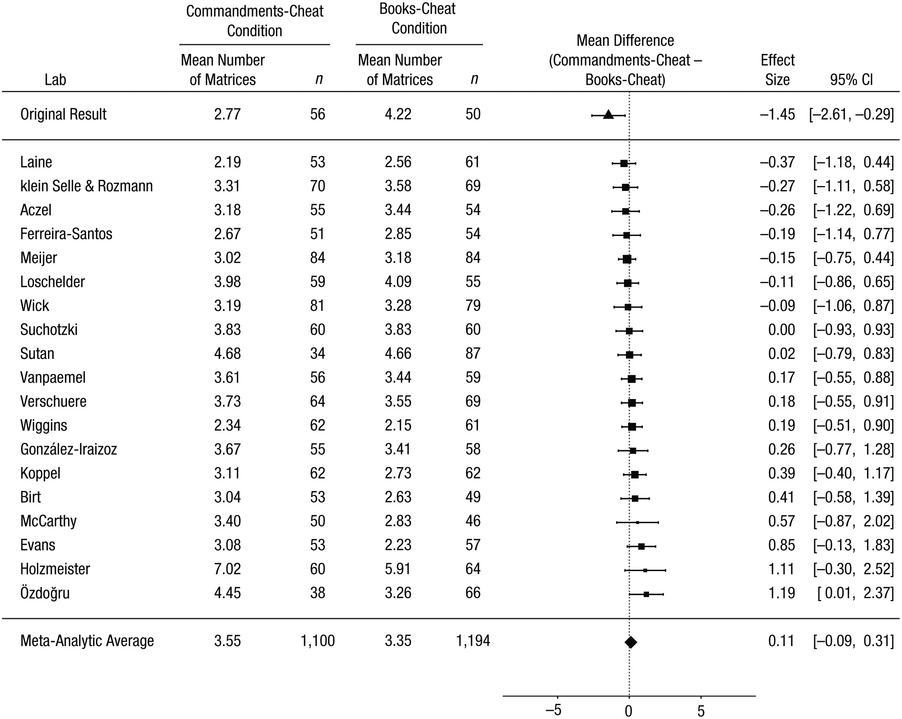
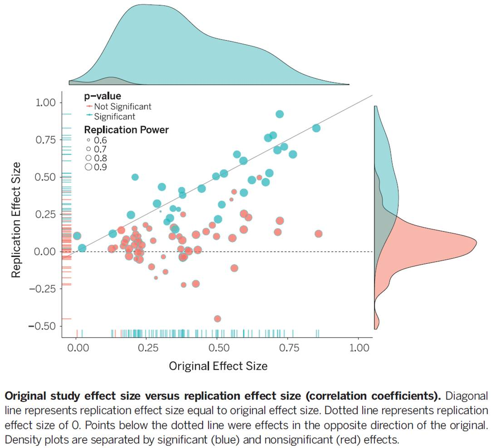

# The replication crisis

> Reproducibility is a defining feature of science, but the extent to which it characterizes current research is unknown. We conducted replications of 100 experimental and correlational studies published in three psychology journals using high-powered designs and original materials when available. Replication effects were half the magnitude of original effects, representing a substantial decline. Ninety-seven percent of original studies had statistically significant results. Thirty-six percent of replications had statistically significant results; 47% of original effect sizes were in the 95% confidence interval of the replication effect size; 39% of effects were subjectively rated to have replicated the original result; and if no bias in original results is assumed, combining original and replication results left 68% with statistically significant effects. Correlational tests suggest that replication success was better predicted by the strength of original evidence than by characteristics of the original and replication teams.
>
> @opensciencecollaboration2015

There is a large experimental literature in behavioural science. It is the product of over 50-years of experimentation, initially conducted in the lab, but increasingly today in the field.

However, over the last decade, there have been increased questions about the reliability of the published results of randomised controlled trials. **Replication** is the ability to re-perform the experiment and collect new data. An experiment is said to replicate if it returns a similar result.

Many results have failed to replicate, and they have failed at a rate that suggests this is a systemic issue.

Below are two examples of replication failures, together with large scale replication projects conducted in psychology and economics.

## Example 1: Disfluency

Adam Alter and friends [@alter2007] exposed 40 students to two versions of the cognitive reflection task. One question in the cognitive reflection task is the following:

> A bat and a ball cost \$1.10 in total. The bat costs \$1.00 more than the ball. How much does the ball cost?

The two versions differed in that one used small light grey font that made the questions hard to read. Those exposed to the harder to read questions achieved higher scores. Slowing people down made them do better.

Eight years later Frederick Meyer and friends [@meyer2015] conducted a replication across many labs involving thousands of people. Whereas the original study found a large effect, the replication found nothing. You can see the original small sample outlier on the bottom left of the chart.

## Example 2: Honest priming

Verschuere and friends [@verschuere2018] replicated a highly cited experiment by Nina Mazar, On Amir and Dan Ariely [@mazar2008] across multiple labs. The abstract of the paper reads as follows:

> The self-concept maintenance theory holds that many people will cheat in order to maximize self-profit, but only to the extent that they can do so while maintaining a positive self-concept. Mazar, Amir, and Ariely (2008, Experiment 1) gave participants an opportunity and incentive to cheat on a problem-solving task. Prior to that task, participants either recalled the Ten Commandments (a moral reminder) or recalled 10 books they had read in high school (a neutral task). Results were consistent with the self-concept maintenance theory. When given the opportunity to cheat, participants given the moral-reminder priming task reported solving 1.45 fewer matrices than did those given a neutral prime (Cohen's d = 0.48); moral reminders reduced cheating. Mazar et al.'s article is among the most cited in deception research, but their Experiment 1 has not been replicated directly. This Registered Replication Report describes the aggregated result of 25 direct replications (total N = 5,786), all of which followed the same preregistered protocol. In the primary meta-analysis (19 replications, total n = 4,674), participants who were given an opportunity to cheat reported solving 0.11 more matrices if they were given a moral reminder than if they were given a neutral reminder (95% confidence interval = \[−0.09, 0.31\]). This small effect was numerically in the opposite direction of the effect observed in the original study (Cohen's d = −0.04).

Figure 2 from the paper demonstrates the result:

## Estimating the reproducibility of psychological science

These examples are illustrative of a wider problem. The Open Science Collaboration [@opensciencecollaboration2015] ran replications of 100 experiments previously reported in three top psychology journals. The abstract captures the disappointing result:

> Reproducibility is a defining feature of science, but the extent to which it characterizes current research is unknown. We conducted replications of 100 experimental and correlational studies published in three psychology journals using high-powered designs and original materials when available. Replication effects were half the magnitude of original effects, representing a substantial decline. Ninety-seven percent of original studies had statistically significant results. Thirty-six percent of replications had statistically significant results; 47% of original effect sizes were in the 95% confidence interval of the replication effect size; 39% of effects were subjectively rated to have replicated the original result; and if no bias in original results is assumed, combining original and replication results left 68% with statistically significant effects. Correlational tests suggest that replication success was better predicted by the strength of original evidence than by characteristics of the original and replication teams.

The results are summarised in this diagram. If the original studies were representative of the results we should expect, the balls should be clustered around the diagonal line. Instead, most are below it, representing the decline in the effect size, with many not significantly different from zero.

## Replication in economics

The replication problem is not just in psychology, although economics has not had such high profile failures to date.

Colin Camerer and friends [@camerer2016] replicated 18 studies from two top economics journals. They found:

> The replicability of some scientific findings has recently been called into question. To contribute data about replicability in economics, we replicated 18 studies published in the American Economic Review and the Quarterly Journal of Economics between 2011 and 2014. All of these replications followed predefined analysis plans that were made publicly available beforehand, and they all have a statistical power of at least 90% to detect the original effect size at the 5% significance level. We found a significant effect in the same direction as in the original study for 11 replications (61%); on average, the replicated effect size is 66% of the original. The replicability rate varies between 67% and 78% for four additional replicability indicators, including a prediction market measure of peer beliefs.

An interesting aspect to these replications was that a prediction market and survey were run in advance to enable academics to predict whether each of the studies would replicate. As can be seen in the diagram, those studies that replicated were predicted to be more likely to replicate than those that did not, although both the survey and prediction market were slightly optimistic in the probability of replication.

