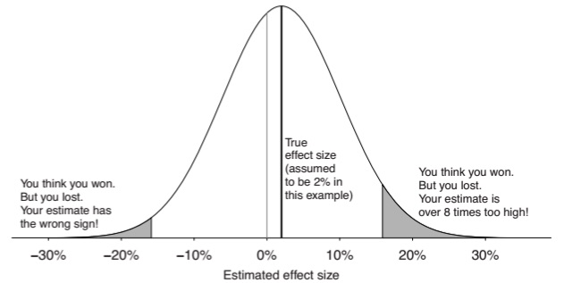

# Type S and M errors

When a null hypothesis is rejected, people tend to report and make decisions based on the point estimate of the sign and magnitude of the effect. We have already highlighted that effect sizes should be treated with caution, but there are alternative ways to examine the properties of this effect size.

One of these is the concept of Type S (Sign) and Type M (Magnitude) errors [@gelman2014].

A Type S error occurs when the sign of the estimated effect is in the opposite direction to the true effect. The Type S error rate is the probability of the sign being in the opposite direction.

A Type M error occurs when the magnitude of the estimated effect is much different from (larger than) the true effect. Type M errors are expressed in terms of the expected exaggeration factor, the expected ratio of the size of the estimated effect divided by the size of the underlying effect.

These errors tend to occur in low powered studies. As one example, suppose we have an effect size that cannot realistically be more than 2 percentage points, and a standard error of 8 percentage points. The below diagram shows the distribution of estimated effect sizes that would occur with this underlying data.

For a statistically significant result, the effect size needs to be \~16 percentage points (around 2 standard deviations greater than zero). This is an 8-fold exaggeration of the true effect size. There is also a 24% probability that, in the case of a significant result, it is in the wrong direction.

{#fig-type_s_and_type_m_error}

This shows that the problem with a low-powered study is not just the high probability of a Type II error. The problem is that even if the researcher gets a statistical significant result, the effect size can have a high probability of being massively exaggerated or even in the opposite direction. This is not just a case of bad luck: in the case of a low powered study, the effect size can only be significant if it is exaggerated.

The net result of this framework is that low-powered studies will always generate at least one form of error, be that Type II or Type M.

## An example

Continuing the example of the ovulatory cycle and voting, Andrew Gelman, Jennifer Hill and Aki Vehtari [-@gelman2020] write:

> In addition, relative to our understanding of the vast literature on voting behavior, the claimed effects seem implausibly large --- a type M error. For example, the paper reports that, among women in relationships, 40% in the ovulation period supported Romney, compared to 23% in the non-fertile part of their cycle. Given that opinion polls find very few people switching their vote preferences during the campaign for any reason, these numbers seem unrealistic. The authors might respond that they don't care about the magnitude of the difference, just the sign, but (a) with a magnitude of this size, we are talking noise (not just sampling error but also errors in measurement), and (b) one could just as easily explain this as a differential nonresponse pattern: maybe liberal or conservative women in different parts of their cycle are more or less likely to participate in a survey. It would be easy enough to come up with a story about that.