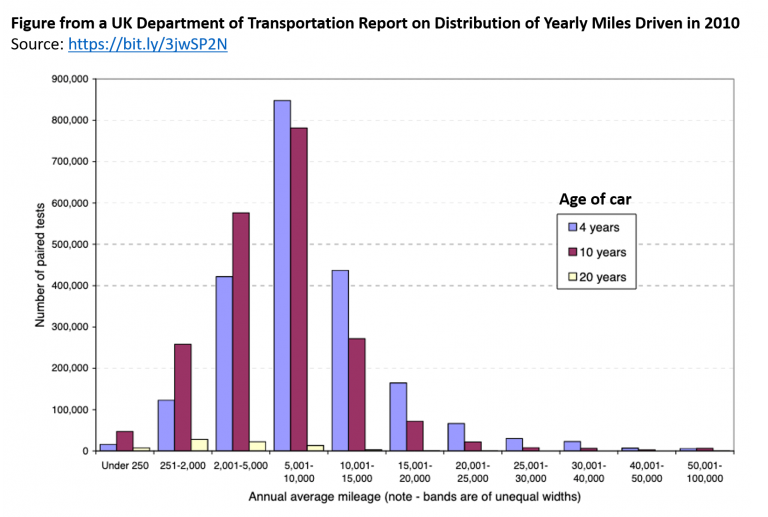
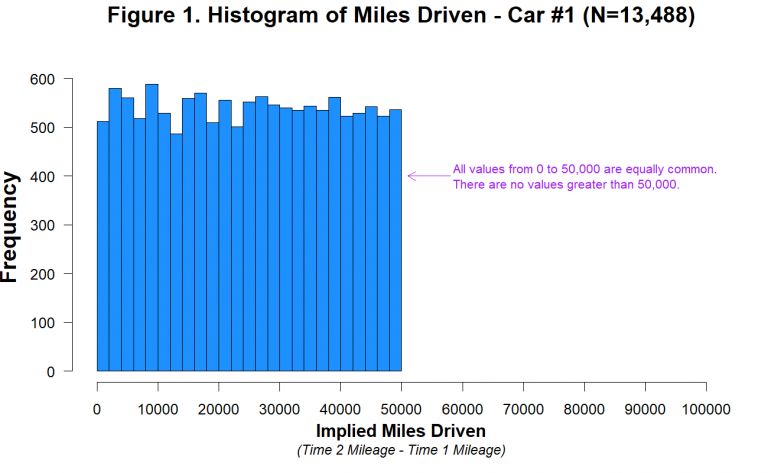

# Data analysis

Once the program has been implemented and you have completed the data collection, you need to analyse these data.

## What is involved

**Compare outcomes for treatment group and control group**

This is typically straightforward because you have randomised people into a treatment and a control group.

**Conduct possible heterogeneity analysis**

It is sometimes interesting to see if the treatment effect differs in different subgroups (heterogeneous treatment effects). For example, is the effect larger for females than for males? To do this, you can compare outcomes for the treatment group and control group among the sample of females, and repeat this comparison for the sample of males. The group must share an observable characteristic that was determined before the start of the program.

We estimate the impact of the program on a subgroup by dropping all the individuals who do not belong to the subgroup and then running the same estimation procedure we do for the full sample.

**Be aware of data mining when there are many outcomes**

If you have many outcomes, you may find a treatment effect only for a few but not consistently for all of them. One needs to be careful not to search too much for an effect that does not exist. Researchers and practitioners now often register a pre-analysis plan for their trial.

## Preparing the data

Before we start any analysis, we prepare (or "clean") the data to ensure we understand their properties. We might:

- Correct any errors in the data. Surveys should have consistency checks built in. However, we should not "overclean" the data.
- Check for outliers. Are the results sensitive to whether certain observations are included or excluded from the analyses? Usually, we do not drop these outliers from the data unless we have prespecified exclusion criterion in the pre-analysis plan.
- Calculate attrition rates. A high attrition rate will tell us that we will need to undertake some analysis to indicate how sensitive our results are to different assumptions about what happened to those for whom we do not have data.
- Calculate compliance rates.
- Plot and describe the data. Exploring the data before formal statistical analysis is useful to uncover problems in the data and understand better the results.

One illustration of the importance of examining the data visually and descriptively relates to Shu et al. (2012). They reported that "signing before—rather than after—the opportunity to cheat makes ethics salient when they are needed most and significantly reduces dishonesty." The paper contained the results of a field experiment whereby applicants for vehicle insurance reported higher mileage and incurred higher premiums when they signed at the top.

Anonymous authors (2021) on *Data Colada* examined the data and wrote:

> Let's first think about what the distribution of miles driven should look like. If there were about a year separating the Time 1 and Time 2 mileages, we might expect something like the figure below, taken from the UK Department of Transportation (.pdf) based on similar data (two consecutive odometer readings) collected in 2010:

> As we might expect, we see that some people drive a whole lot, some people drive very little, and most people drive a moderate amount.
>
> As noted by the authors of the 2012 paper, it is unknown how much time elapsed between the baseline period (Time 1) and their experiment (Time 2), and it was reportedly different for different customers [3]. For some customers the "miles driven" measure may reflect a 2-year period, while for others it may be considerably more or less than that [4]. It is therefore hard to know what the distribution of miles driven should look like in those data. It is not hard, however, to know what it should not look like. It should not look like this:

The data had been fraudulently generated. However, during the original analysis by Shu et al. (2012) and a review of the data by Kristal et al. (2020), nobody had picked this up as (likely) no one had done a simple plot.

## References

Anonymous (2021) "[98] Evidence of Fraud in an Influential Field Experiment About Dishonesty." *Data Colada*. August 17, 2021. http://datacolada.org/98

Kristal et al. (2020) "Signing at the beginning versus at the end does not decrease dishonesty", PNAS, 117(13), 7103-7107, https://doi.org/10.1073/pnas.1911695117

Shu et al. (2012) "Signing at the beginning makes ethics salient and decreases dishonest self-reports in comparison to signing at the end", *PNAS*, 109(38), https://doi.org/10.1073/pnas.1209746109
