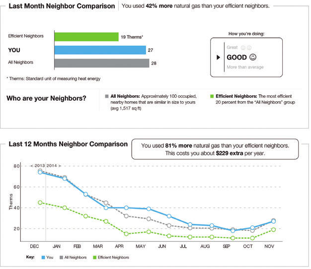

# Define the outcome measure

## Observable signals of changes

An important part of the trial design is to define observable signals of changes.

Impact is the changes our program aims to achieve. Often these changes are conceptual, such as “financial wellbeing.”

Outcomes are observable signals of these changes, such as “credit card balance” or “ability to read a simple paragraph.” Indicators measure whether the impact is in fact happening. If an evaluation is to be influential in broader policy debates, it is useful to include outcome measures and indicators that are commonly used in the literature for assessing programs with similar objectives.

An outcome measure must be:

-   **Observable**: it must be a behavior or state that can be observed in the real world. Happiness is not an observable indicator, but self-reported happiness is.
-   **Feasible**: it must be feasible to measure politically, ethically and financially.
-   **Detectable**: it must be detectable with your instruments and statistical power (to which we will come back in Module 3) of your experiments.

***Jargon used in data collection***

| **Term** | **Definition** | **Examples** |
|------------------|-----------------------------|-------------------------|
| Impact | A change caused by the program we are evaluating | Increase or decrease in women's empowerment, child health, corruption |
| Outcome | An observable signal used to measure impact | The number of women who spoke at a meeting, child's arm circumference |
| Instrument | The tool we use to measure the outcomes | A survey question, achievement test, direct observation record |
| Variable | The numerical values of the outcomes |  |

### When designing instruments don't forget social-desirability bias

When designing your instrument, you need to think about the possibility of **social-desirability bias**. It is a form of response bias in which participants prefer to answer questions in a way that will be viewed favourably by others instead of reporting the truth. It can take the form of over-reporting "good behaviour" or under-reporting "bad", or undesirable behaviour. Social-desirability bias is more likely to occur when the topic of the question is a sensitive one. Potential ways to reduce social-desirability bias includes (i) using computer-assisted interviews instead of face-to-face or phone interviews, (ii) providing financial incentives for reporting the truth, (iii) using proxy indicators (e.g. childbearing instead of unprotected sex) or (iv) conducting a list experiment.

Voting is typically a sensitive topic. During the U.S. 2016 presidential campaign featuring Hillary Clinton (Democratic candidate) against Donald J. Trump (Republican candidate), pre-election polls showed Clinton leading Trump in the battleground states that decided the presidency. There are several reasons that may explain why they got it wrong. One of them may be social-desirability bias. @brownback2018 conducted three list experiments to test this and found evidence that explicit polling overstates agreement with Clinton relative to Trump.

#### What is a list experiment?

Suppose you are trying to gauge support for a political position, but responses are clouded by social desirability bias.

One approach to overcoming social desirability bias is to use a list experiment. In a list experiment, the sample is randomly divided into two groups. The first group is presented with a list of neutral and non-sensitive items (length=N). The second group is presented with an identical list plus the sensitive item (length=N+1). They are then asked how many of the items they agree with.

For example, the first group might be asked: How many of the following statements do you agree with?

-   Ice cream is better than bacon.
-   Summer is the best season.
-   Bicycle riders should not have to wear helmets.
-   AFL is the most Australian sport.

The second group would be shown the same list, plus an additional item, such as:

-   I will vote for Donald Trump in the next Presidential election.

Note that the group members are not asked which items they agree with. They are only asked how many. This gives the respondent a degree of privacy. A researcher could not conclusively determine whether a person would vote for Donald Trump unless the person answered 0 or N+1.

With a large enough sample, researchers can estimate the proportion of people to whom the sensitive item pertains, in this case, voting for Trump, by subtracting the average number of agreements of the first group from the average number of agreements of the second group. For example, if the average number of agreements is 2.6 in the first and 3.2 in the second, the average number of agreements with the Trump statement is 0.6. This can be done as the responses to the non-sensitive questions across the two groups should, with large enough sample, be equal.

### Case study: An HIV education program in Kenya

This case study taken from @glennerster2013a

illustrate a two-step process for selecting outcomes and instruments during program evaluation: (1) mapping the theory of change and (2) determining indicators that are the logical consequences of each step in the theory of change.

> A program in Kenya provided in-service training for teachers to improve their delivery of HIV prevention education in primary schools.
>
> The training focused on how to teach HIV/AIDS prevention best practices while teaching other subjects and how to start and run after school student health clubs devoted to HIV/AIDS education.
>
> A simple theory of change for the program says that teacher training (1) increased HIV education, which (2) increased knowledge of prevention best practices, which (3) reduced unsafe sexual behavior, which (4) led to reduced HIV infection rates.
>
> HIV status is the ultimate outcome of interest. If we can measure HIV status in both our treatment and our comparison groups, we can know whether our program changed HIV infection rates. Although testing HIV status is common in the literature, it may be too expensive as well as ethically, politically, or logistically infeasible in our context. If this is the case, we can use other indicators as proxies for HIV rates, such as self-reported sexual behavior or childbearing.
>
> We may also be interested in more proximate outcomes, such as changes in knowledge, that are not captured by HIV status. Indeed, HIV status is not a valid measure of knowledge of best practices, because someone may know the best prevention methods but choose to not practice them. Measuring these intermediate outputs and outcomes would allow us to learn about the underlying mechanisms that can translate program inputs into impacts. For example, if the program failed to achieve the desired impact, did it fail because it did not change knowledge or because changing knowledge did not change behaviour?

The following table shows the program theory. For each of the concepts in the causal chain, it also suggests potential indicator in the real world that we can observe and measure.

***Logical framework for the HIV education program.***

| **Input, Outputs/Outcome** | **Objectives hierarchy** | **Indicators** | **Assumptions or threats** |
|------------------|------------------|------------------|------------------|
| Inputs (activities) | Teachers are trained to provide HIV education | Hours of training implemented | Teachers engage with the training and learn new concepts |
| Outputs | Teachers increase and improve HIV education | Hours of HIV education given; application of the program's teaching methods | Teachers are receptive to changing their HIV education approach, and outside pressures do not prevent them from implementing a new curriculum |
| Outcome (project objective) | Students learn prevention best practices | Test scores on HIV education exam | Students engage with the new curriculum, and understand and retain the new concepts |
| Impact (goal, overall objective) | Students reduce their unprotected sexual behaviour; incidence of HIV infection decreases | Self-reported sexual behaviour; number of girls who have started child-bearing; HIV status | The information students learn changes their beliefs and their behaviour. Students can make decisions and act on their preferences for engaging in sexual behaviour |

## Level of outcome

What outcome do you want for you, your customers, your employees or citizens?

Consider a trial to test whether text messages containing one of several behaviourally-informed messages, such as a social norm and a loss frame, can increase the level of repayment of credit card debt.

The level of repayment of the credit card debt is one outcome. But what of:

-   The change in credit card balance over time?
-   The change in all debt balances over time (credit cards or otherwise)?
-   The allocation of those debt balances over different financial instruments (such as shifts to payday lenders)?
-   The change in their net financial position (considering both debt and savings)?
-   Their subjective financial wellbeing?

Which of these outcomes are most interested in? This likely would have been asked in the "define" stage of the project that led to the trial, but it is easy to forget broader objectives once a trial is designed. They need to be kept in mind, particularly for the purposes of measurement.

### Measurement

When designing a trial, whether you can measure an outcome is almost as important as what outcome you are interested in. The outcome variable for the experiment needs to be measurable.

Consider the credit card example above. If you are the financial institution that issued the credit card you can likely measure both the change in repayments and the change in the credit card balance over time.

If you offer a suite of financial products to customers, you may be able to monitor changes in balances of other savings and debt products for a subset of the customers. You may also be able to infer use of financial products from other providers by observing transactions. Together these can help you understand the broader distribution of debt balances and net financial position. However, this will be a partial picture and could be biased, particularly if those who hold many products with you have different characteristics than those who hold just a credit card.

Subjective financial wellbeing, although being a broader measure, may actually be easier to obtain. You could add a survey component to your trial and obtain a direct measurement. The challenge there, however, is whether a minor intervention such as a text message can shift subjective financial wellbeing enough for you to detect it in a trial.

Beyond outcomes, you might also want to measure process pieces. For example, if looking at debt on credit card, you might collect data on payment patterns. What day and time do they pay? How much each payment? What method of payment? Where did the payment come from? This could enable you to better understand how or why your intervention works and provide further ideas for testing.

Due to practical requirements, measurement may simply involve analysis of the data you already collect. Many measures of interest are already collected, and if your experiment can capitalise on that, it may improve feasibility and reduce cost. However, this may also create an arbitrary break to the extent of the outcomes that you want to examine.

### Example: reducing power consumption

Power companies often want to limit their customers' electricity demand. This might be for environmental reasons or to reduce peak demand.

One method to achieve this is to give that person or household a comparison of their power consumption with that of their neighbours. People have a desire to conform, and look to cues to inform their decisions. If shown that their power usage is above their neighbours, they tend to reduce their use.

That is one possible outcome: reduced electricity usage. A related direct outcome is the financial saving through reduced power usage. Do they pay a smaller power bill?

But these are narrow outcomes. Broader questions could be asked.

What was the net change in energy usage by the household? Was there substitution into gas or other energy sources? What is the emissions profile of these changes? What is the cost?

More broadly, what was the total change in household expenditure due to the intervention? Did they pay for energy savings appliances or fitouts to their house? What did they spend any energy bill savings on? How much time did they expend changing their energy usage?

Even those questions might be seen as narrow. If the individual or household's objectives were purely financial, there may be a success. They have saved on their power bill. Their reduction in use also aligns with the environmental or peak demand reduction objectives of the electricity provider. But what if their objective is satisfaction in life? Or comfort? Did they freeze during winter and swelter during summer to maintain their self-image? You have just compared them negatively with their neighbour. Did their happiness change when they saw that they compared poorly? Did it increase mental stress?

Measuring many of those outcomes are difficult. But that does not mean that they don't matter.

@allcott2019 sought a broader measure of the benefits of the comparisons by asking customers their "willingness to pay" for the home energy reports that contained comparisons of their energy use. This willingness to pay measure supported the argument that there was a net welfare gain from the the comparison. However, because the willingness to pay measures capture the broader costs and benefits of the energy reports beyond simple changes in energy usage, they found that the welfare gains were much smaller than assessed using narrow measures.

Perhaps most interestingly, one third of the recipients would be willing to pay to not receive the report. For those customers, the psychological or other costs outweighed any information benefit.