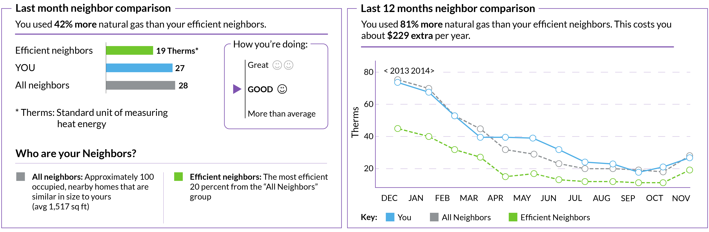

# Level of outcome

Consider a trial to test whether text messages containing one of several behaviourally-informed messages, such as a social norm and a loss frame, can increase the level of repayment of credit card debt.

The level of repayment of the credit card debt is one outcome. But what of:

- The change in credit card balance over time?
- The change in all debt balances over time (credit cards or otherwise)?
- The allocation of those debt balances over different financial instruments (such as shifts to payday lenders)?
- The change in their net financial position (considering both debt and savings)?
- The ultimate impact: their subjective financial wellbeing?

Which of these are you most interested in? This likely would have been asked in the "define" stage of the project that led to the trial, but it is easy to forget broader objectives once a trial is designed. They need to be kept in mind, particularly for the purposes of measurement.

## Measurement

When designing a trial, whether you can measure an outcome is almost as important as what outcome you are interested in. The outcome variable for the experiment needs to be measurable.

Consider the credit card example above. If you are the financial institution that issued the credit card you can likely measure both the change in repayments and the change in the credit card balance over time.

If you offer a suite of financial products to customers, you may be able to monitor changes in balances of other savings and debt products for a subset of the customers. You may also be able to infer use of financial products from other providers by observing transactions. Together these can help you understand the broader distribution of debt balances and net financial position. However, this will be a partial picture and could be biased, particularly if those who hold many products with you have different characteristics than those who hold just a credit card.

Subjective financial wellbeing, although being a broader measure, may actually be easier to obtain. You could add a survey component to your trial and obtain a direct measurement. The challenge there, however, is whether a minor intervention such as a text message can shift subjective financial wellbeing enough for you to detect it in a trial.

Beyond outcomes, you might also want to measure process pieces. For example, if looking at debt on credit card, you might collect data on payment patterns. What day and time do they pay? How much each payment? What method of payment? Where did the payment come from? This could enable you to better understand how or why your intervention works and provide further ideas for testing.

Due to practical requirements, measurement may simply involve analysis of the data you already collect. Many measures of interest are already collected, and if your experiment can capitalise on that, it may improve feasibility and reduce cost. However, this may also create an arbitrary break to the extent of the outcomes that you want to examine.

::: {.callout-note}
## Example: Reducing power consumption

Power companies often want to limit their customers' electricity demand. This might be for environmental reasons or to reduce peak demand.

One method to achieve this is to give that person or household a comparison of their power consumption with that of their neighbours. People have a desire to conform, and look to cues to inform their decisions. If shown that their power usage is above their neighbours, they tend to reduce their use.

That is one possible outcome: reduced electricity usage. A related direct outcome is the financial saving through reduced power usage. Do they pay a smaller power bill?

But these are narrow outcomes. Broader questions could be asked.

What was the net change in energy usage by the household? Was there substitution into gas or other energy sources? What is the emissions profile of these changes? What is the cost?

More broadly, what was the total change in household expenditure due to the intervention? Did they pay for energy savings appliances or fitouts to their house? What did they spend any energy bill savings on? How much time did they expend changing their energy usage?

Even those questions might be seen as narrow. If the individual or household's objectives were purely financial, there may be a success. They have saved on their power bill. Their reduction in use also aligns with the environmental or peak demand reduction objectives of the electricity provider. But what if their objective is satisfaction in life? Or comfort? Did they freeze during winter and swelter during summer to maintain their self-image? You have just compared them negatively with their neighbour. Did their happiness change when they saw that they compared poorly? Did it increase mental stress?

Measuring many of those outcomes are difficult. But that does not mean that they don't matter.

Hunt Allcott and Judd Kessler sought a broader measure of the benefits of the comparisons by asking customers their "willingness to pay" for the home energy reports that contained comparisons of their energy use. This willingness to pay measure supported the argument that there was a net welfare gain from the the comparison. However, because the willingness to pay measures capture the broader costs and benefits of the energy reports beyond simple changes in energy usage, they found that the welfare gains were much smaller than assessed using narrow measures.

Perhaps most interestingly, one third of the recipients would be willing to pay to not receive the report. For those customers, the psychological or other costs outweighed any information benefit.
:::

## Optional reading

Allcott and Kessler (2019) "The Welfare Effects of Nudges: A Case Study of Energy Use Social Comparisons", *American Economic Journal: Applied Economics*, 11(1), 236-276, https://doi.org/10.1257/app.20170328
