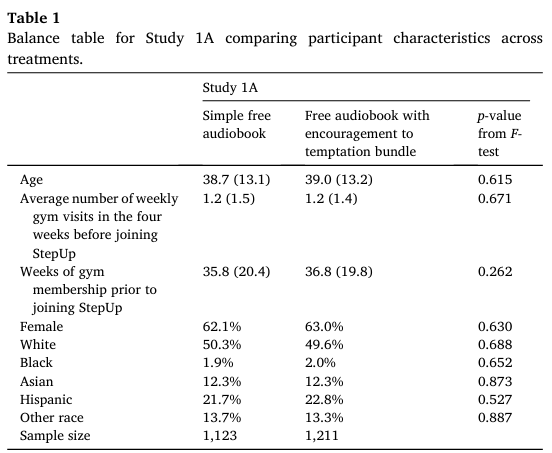

# Randomisation techniques

As we discussed earlier, randomisation provides indirect control of uncontrolled variables. It provides us with a way to infer that differences in outcomes are due to the treatments and not due to the individual characteristics of the experimental participants.

However, randomisation is not a panacea, nor is it always practical to undertake a pure randomisation. The below discusses two complications that can be involved in randomisation.

::: {.panel-tabset}

## Performing random assignment

To perform random assignment, we need:

- A list of eligible units (e.g. people, branches, schools)
- The number of randomisation cells (e.g. two if you have one treatment and the control)
- The allocation fraction: the proportion of the eligible units to be assigned to each group (e.g. 50%, 50%)
- If feasible, initial data on the eligible units for stratification and balance

The randomisation is balanced if the mean characteristics of each group are equal. For example, each group has the same gender split. If we have data available, we can run a "balance check" to confirm that the groups that were created are balanced.

We check for balance to:

- Check that the assignment was properly randomised
- Confirm that as undesirable lack of balance has not been caused by chance.

Randomisation occasionally leads to a large correlation between treatments and uncontrolled nuisance variables within a trial. For example, your control and intervention groups, by chance, may end up having people with higher incomes in one group than the other, or an unbalanced mix of sexes. If you are running only a small number of trials (often only one), this lack of balance can bias your results.

The following excerpt gives an example where two groups in a field trial became unbalanced.

> In 2012, we came up with a seemingly costless simple intervention: Get people to sign a tax or insurance audit form before they reported critical information (versus after, the common business practice).
>
> We ran studies showing that when people signed an honesty declaration before reporting information, they thought about how they were honest people, and were less likely to misreport compared to when they signed after they had filled out the form. While our original set of studies found that this intervention worked in the lab and in one field experiment, we no longer believe that signing before versus after is a simple costless fix. ...
>
> In an attempt to replicate and extend our original findings, three people on our team (Kristal, Whillans and Bazerman) found no evidence for the observed effects across five studies with 4,559 participants. We brought the original team together and reran an identical lab experiment from the original paper (Experiment 1). The only thing we changed was the sample size: we had 20 times more participants per condition. And we found no difference in the amount of cheating between signing at the top of the form and signing at the bottom.
>
> In light of these findings, we reanalyzed the field study in the original paper and became concerned with a failure of random assignment (such that the number of miles driven before the intervention was delivered was significantly different between the two groups). What we originally thought to be a reporting difference (between customers who signed at the top versus bottom of the form) now seems more likely to be a difference in actual driving behavior—not the honest or dishonest reporting of it.
>
> *Kristal et al (2020)*

If the samples are not balanced, re-performing the randomisation is not considered good practice. Rather, you do stratified random assignment, or "blocking".

The following table is an example of a balance check from Kirgios et al (2020). The characteristics of the members of each group are compared, with a statistical test to check that there is not a statistically significant difference in these characteristics.

Of note, the more characteristics against which you check for balance, it becomes increasingly likely that you will find an unbalanced characteristic simply by chance

## Blocking / stratification

There are experimental designs that can reduce the effect of unbalanced groups. These work by holding a set of variables constant within a subset of trials (a "block" or "strata"). These variables are often called blocking variables.

Stratified random assignment provides a way to ensure that our treatment and control groups are balanced on key variables. We first divide the pool of eligible units into strata. Within each stratum, we follow the procedure for simple random assignment.

For example, suppose we are going to test discrimination in hiring by sending CVs in response to job ads. We believe that large and small firms will respond differently. We can split the firms into two blocks, small and large, and then randomise within each of those blocks. This will balance the small and large firms across the control and intervention groups and ensure we don't get an unbalanced experiment on that dimension.

You should stratify when:

- We want to ensure balance in key characteristics (the smaller the sample size, the higher the chance that randomisation may return unbalanced groups)
- We want to increase statistical power. Stratifying on variables that are strong predictors of the outcome can increase statistical power.
- When we want to analyse treatment effect by subgroup.

Which stratification variables should we use?

- Discrete variables (we cannot stratify on continuous variables like income and credit score, but we can create discrete groups such as income deciles)
- Variables that are highly correlated with the outcome of interest. If available, the baseline value of the outcome of interest is an important stratification variable.
- Variables on which we will do subgroup analysis (if we want to look at treatment effect by gender, we want balance on gender)
- We do not want to stratify on too many variables, or we may find we have strata with only one or no units in them.

## Within-subject designs

Most of the experiments we have discussed involve a "between-subject" design. The treatment and control groups comprise different subjects, with comparisons made between those subjects.

An alternative is within-subject design, whereby experimental subjects make decisions in all treatments.

Suppose we are working on increasing on-time credit card payments by sending a reminder. We might run the trial over two periods, sending a reminder to half the participants for the first payment period, and then a reminder to the other half in the second period. The control and treatment groups across the two periods are balanced as they contain the same people. This within-subjects design is called a crossover study, as participants cross over from one group to the other.

Under a within-subject design, each subject is effectively their own control, meaning that we do not need to worry about the different characteristics of decision makers. Apart from avoiding unbalanced treatment and control groups, this means there is usually less variation in treatment effects, increasing the power of the experiment.

A major disadvantage of a within-subject design is that there may be "order effects". The intervention in one period may flow into another period. There may be effects such as fatigue. The reverse order that participants receive the treatment in a "crossover" study, such as the example above, can be used to attempt to account for these order effects, although it complicates the analysis.

Within-subject designs tend to be used where we have a limited number of experimental participants or are looking for efficiencies in the conduct of the experiment, as the design can increase power with fewer participants relative to a between-subjects design. You might also use it where you are interested in the longitudinal aspect of the interventions.

:::

## References

Kirgios, Mandel, Park, Milkman, Gromet, Kay, and Duckworth (2020) "Teaching temptation bundling to boost exercise: A field experiment" *Organizational Behavior and Human Decision Processes*, 161, 20–35, https://doi.org/10.1016/j.obhdp.2020.09.003

Kristal et al. (2020) "When We're Wrong, It's Our Responsibility as Scientists to Say So", *Scientific American*, https://blogs.scientificamerican.com/observations/when-were-wrong-its-our-responsibility-as-scientists-to-say-so/

List, Sadoff and Magner (2010) "So you want to run an experiment, now what? Some simple rules of thumb for optimal experimental design", *Experimental Economics*, https://doi.org/10.1007/s10683-011-9275-7
