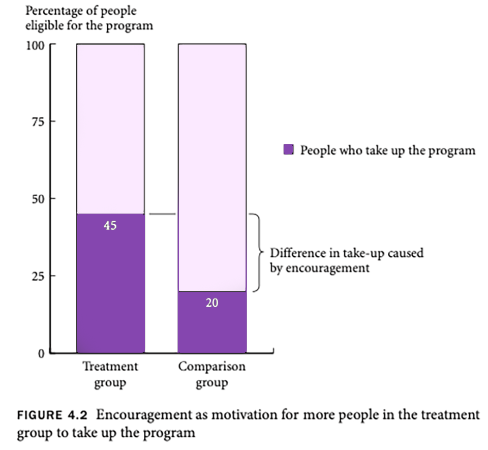

# What can be randomised?

There are three basic ways in which a program can be randomised.

::: {.panel-tabset}

## Access

We can choose which people are offered **access** to a program.

This is the most common way to randomise.

::: {.callout-note appearance="simple"}
For example:

"Draw a list of 200 eligible branches and then randomly select 100 to receive the new product."
:::

## Timing

We can choose **when** people are offered access.

Sometimes, everyone needs access to the program (e.g. by law, fairness). We can randomly assign the time when people get access to the program.

For example, suppose a new medical treatment is proposed. Group A could get the treatment in Year 1, Group B in Year 2 and Group C in Year 3. Groups B and C are control groups in Year 1. Group C is a control group in Year 2.

**Phase-in designs** may result in "anticipatory effects". The anticipation of treatment may affect the behaviour of the control group, leading to an overestimate or underestimate of the impact.

For example, consider a program that provides a laptop to each student at schools. Suppose some parents of children in the control group that planned to purchase a home computer before the evaluation decided not to purchase it and wait for their child to receive a laptop. This behavioural change is important: some parents in control group behaved differently than they would have if the program did not exist. They are no longer the best representation of the counterfactual.

Another implication of phase-in designs is that, since the control group receives treatment after a fixed time frame, there is a limited time over which impact can be measured. The evaluation of the program's impact will be of short-term outcomes.

## Encouragement

We can choose which people are **encouraged** to participate

Encouragement might be a small incentive, a letter, or a phone call that reminds people of their eligibility and details the steps to enrol in the program. Messaging is a form of encouragement design.

Encouragement is useful to evaluate a program already open to all eligible recipients, but only some are currently using it. Effective encouragement leads to higher take-up of the program in the treatment group than in the control group.

It is important to note that the impact of receiving encouragement to take up the program is evaluated (and its indirect effect on program take-up), rather than the direct impact of the program itself.

When studying the program's impact, comparing the entire treatment group to the entire control group is important. When analysing the results, individuals in the treatment group who receive encouragement but do not apply for the program must still be considered a part of the treatment group. Similarly, individuals in the control group who apply for the program without special encouragement must remain in the control group for analysis.

Encouragement designs attract the following considerations:

- The program to be evaluated must be undersubscribed.
- To generate impact estimates, the encouragement must induce significantly higher take-up rates in the treatment group compared to the control group.
- The encouragement should not have a direct effect on the outcome.
- Everyone must be affected by the encouragement incentive in the same direction. If the encouragement itself increases the take-up of some groups and reduces the take-up of others, impact estimates will likely be biased.

:::

## References

Glennerster and Takavarasha (2013) "[Randomizing](https://doi-org.ezproxy.lib.uts.edu.au/10.2307/j.ctt4cgd52.8)" in *Running Randomized Evaluations: A Practical Guide* (pp. 98–179). Princeton University Press.
