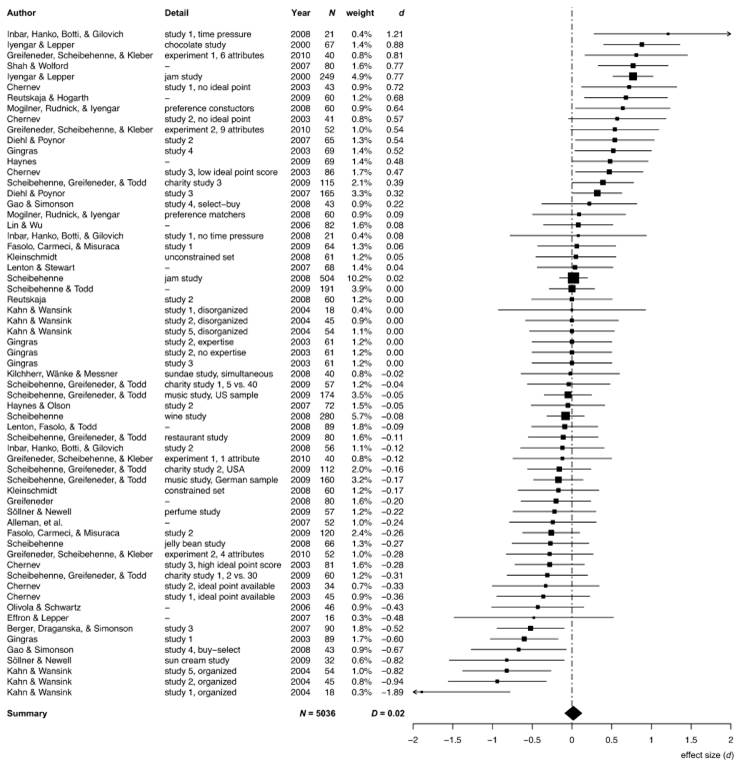

# Effect sizes

Statistical significance is not the same as practical importance. A statistically significant result may not be large enough to matter in practice. You are interested not just in whether treatment affects people, but also in how much.

For example, which is the more interesting result? A statistically significant experimental treatment that could boost the financial wellbeing of all Australians by \$2 (p=0.04). Or a non-significant experimental treatment that could boost the financial wellbeing of all Australians by \$1000 (p=0.06)?

Effect sizes from experiments should be interpreted and reported with caution. While often reported as a point estimate, we can provide a confidence interval around the estimated effect size. Effect size with a p-value marginally below 0.05 will have a confidence interval with a lower end only marginally above 0.

## Cohen's *d*

One common way in which effect sizes are talked about is "Cohen's *d*". Cohen's *d* is defined as the difference of two means divided by the standard deviation of the data. It is calculated as:

$$d=\frac{\bar{x}_1-\bar{x}_0}{s}=\frac{\mu_1-\mu_0}{s}$$

where *s* is the pooled standard deviation of the data (you don't have to know how to calculate that.)

Cohen's *d* has the benefit of translating effect sizes in different experiments onto a common scale. You can speak of how many standard deviations an effect size is.

It is common to label different sizes of Cohen's *d*. A Cohen's *d* of 0.2 is typically called a small effect, 0.5 is medium, and 0.8 is large. When people are calculating power for an experiment, they will often think in terms of whether the effect is small, medium or large, and use the associated number. One way this can mislead, however, is that many effect sizes in the social sciences are far less than 0.2.

## Summarising effect sizes

One place you often see wonderfully transparent communication of effect sizes are in meta-analyses (summaries of the literature) or multi-lab replications. Below is one example. (Note that the effect sizes are standardised as Cohen's *d*.)

### The jam experiment

On two Saturdays in a California supermarket, Mark Lepper and Sheena Iyengar [-@iyengar2000] set up tasting displays of either six or 24 jars of jam. Consumers could taste as many jams as they wished, and if they approached the tasting table they received a \$1 discount coupon to buy the jam.

For attracting initial interest, the large display of 24 jams did a better job, with 60 per cent of people who passed the display stopping. Forty per cent of people stopped at the six jam display. But only three per cent of those who stopped at the 24 jam display purchased any of the jam, compared with almost 30 per cent who stopped at the six jam display.

This result has become the classical example of the "paradox of choice". More choice can lead us to fail to make a choice.

Later, @scheibehenne2010 surveyed the literature on the choice overload hypothesis. This chart is a plot of the effect sizes across the literature. Of those that are significant - that is, those for which the 95% confidence interval does not contain zero - they have a large point estimate of effect size, yet a 95% confidence interval barely excluding zero.

Looking across these experiments, in some cases, choice increases purchases. In others it reduces them. Scheibehenne and friends determined that the mean effect size of changing the number of choices across the studies was effectively zero.

