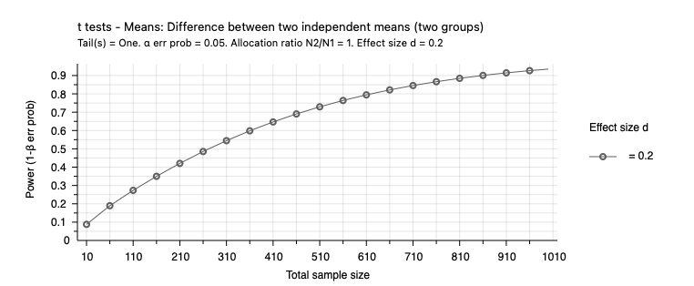
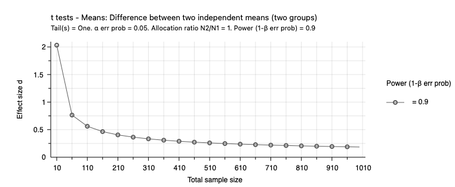

# Power analysis

Once you have all the ingredients for a power calculation, how do you actually conduct it? Many statistical packages have sample size function. Free tools are also available, such as [G\*Power](https://www.psychologie.hhu.de/arbeitsgruppen/allgemeine-psychologie-und-arbeitspsychologie/gpower).

There are two common approaches for conducting power analysis.

## Power determination approach

The first approach begins with an assumption about the effect size the intervention produces, and the aim is to compute the power they will have to detect that effect with given sample size.

For example, suppose that a team of researchers is planning a study to detect the effect of a school-level intervention aimed at improving math achievement for third graders. They plan to randomise schools to receive either the treatment or continue with the current protocol. Pilot studies and available theory suggest that a practically significant effect would entail a standardized effect size of 0.20; that is, a mean difference equivalent to 0.20 in units of the population standard deviation of the outcome (more about this on a following page). Thus the researchers want to plan the study to be able to detect an effect of at least 0.20 standard deviation units. In this case, the effect size is already determined, and the researchers are interested in calculating the sample size necessary to achieve the power of 0.80. Of course, this process can be repeated for a range of effect sizes.

## Effect size approach

The second approach begins with a desired level of power and the aim is to compute the minimum effect size that can be detected at that level of power for any given sample size. This approach can, of course, be replicated at any given level of power. The minimum detectable effect size is the smallest true effect that can be detected for a specified level of power and significance level for any given sample size.

For example, suppose that another team of researchers is studying a whole-school reform model. They plan to randomise schools to either the new reform model or current conditions. Because of financial considerations, the team can only recruit 50 schools and 100 students within each school. The sample size is set, thus the researchers are trying to determine the smallest effect size they can detect with the pre-specified sample size.

The power determination and effect size approaches represent two ways to conduct a power analysis. However, both approaches yield the same conclusions. That is, a power analysis could be conducted using either approach, and ultimately the same conclusions would be reached.

The two graphs below graphs, drawn with the G\*Power software, show how power and the minimum detectable effect size change with sample size. Both graphs assume a significance level of 0.05. The first graph uses the power determination approach and plots power against sample size for an effect size of 0.2. It shows that power increases with sample size. It also shows that we have more power for the same sample size when the effect size is larger. The second graph uses the effect size approach and plots the effect size against the sample size for 90% power. It shows that for a given level of power, we can detect a smaller effect size when the sample size is larger.

## Pre- and post-experiment power analysis

Power calculations should be done **before** an experiment. It is used to determine what sample size is required to obtain the requisite power. A common practice is obtaining a sample size sufficient to achieve 80% power, although there is little reason to limit yourself to that level of power if you can increase power at a modest cost.

Power calculations are also often done after an experiment. You will see in the literature that post-experiment power calculations are regularly used to justify that the experiment had sufficient power, with the effect size found in the experiment as the basis for the power calculation. This is poor practice, as a significant result in an underpowered experiment will tend to exaggerate the effect size. If you then use this exaggerated effect to calculate power, it gives the impression that the experiment was adequately powered. We will discuss this exaggeration of effect size later in the unit.

If a power calculation is done after the experiment, it should only be done using a well-grounded assumed effect size, not the effect size observed in the experiment.

An alternative use of post-experiment power calculations is to examine whether published experiments should show the proportion of significant results that they do. If a set of experiments has an average power of 80%, only 80% should find a statistically significant effect. A higher proportion suggests publication bias (a topic later in the unit).

## Optional reading

Glennerster, R., & Takavarasha, K. (2013). [Statistical Power](https://doi-org.ezproxy.lib.uts.edu.au/10.2307/j.ctt4cgd52.10). *Running Randomized Evaluations: A Practical Guide* (pp. 241–297). Princeton University Press.
