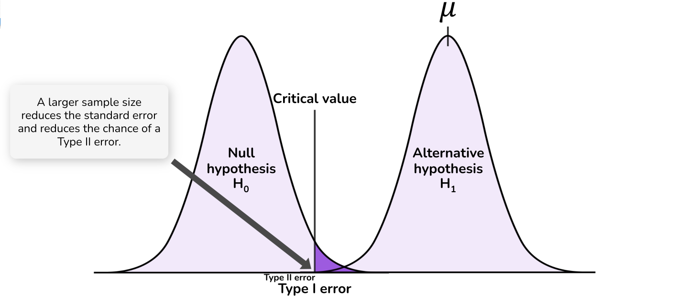
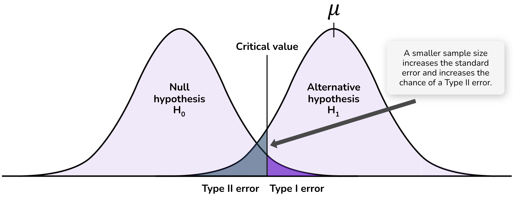

# Statistical power

The probability of a Type II error is $\beta$, the probability that you will not reject the null hypothesis when it is false.

A related concept is power, which is the probability that you will *reject* the null hypothesis when it is false. Power is equal to 1 - $\beta$.

Questions related to the Type II error rate for a trial are typically framed in terms of power. How can I design my trial so that it has enough power to reject the null hypothesis in circumstances where it is not true? Alternatively, how can I increase the probability that my trial will achieve statistical significance when the null hypothesis is not true?

## Calculating power

Statistical power can be calculated with the following variables:

**The significance level**: The stricter the significance level that you use in your experiment, the lower the power of the experiment. There is a trade-off between Type I and Type II errors. As you decrease the probability of false positives by using a stricter significance level, you also decrease the probability of true positives. You should not relax the significance level to achieve power, but should be aware of the consequences of making it more strict.

**The effect size**: What is the magnitude of the effect of your intervention? The larger the effect size, the more power the experiment has to detect an effect and generate a statistically significant outcome.

Unfortunately, as you have not yet run the experiment, you do not know what the effect size is. If there are other studies with which parallels can be drawn, you can make an educated guess as to its likely size. You might generate your estimate through a literature review, pilot studies or other related experiments.

Estimates of the effect size should be conservative. As we will see later in this unit, the experimental literature is full of over-exaggerated effect sizes. An overestimate of the effect size will overestimate the power of the experiment.

You also need to understand the variability of the effect size (such as its standard deviation in the population of interest) to calculate power. A highly-variable effect will have a higher standard error in its measurement, so more probability of getting an extreme result that generates an error.

As a result, when an effect size estimate is made, it it typically made as a standardised effect size. This is the magnitude of the effect divided by the standard deviation. How many standard deviations is the effect?

You don't have the ability to increase the effect size. However, variation in the effect size is affected by things such as measurement error. More precise measurement can increase power.

**The sample size**: Power is a function of the sample size of the experiment. It is the factor over which you have the most control.

Increasing the sample size reduces the standard error of your estimated effect size. This means that, if the alternative hypothesis is true, you will have a greater probability of detecting an effect of any given size. The following diagrams illustrate how sample size affects the probability distributions and Type II error:

::: {layout-ncol=1}

:::

Beyond increasing power, larger samples have other benefits such as reducing the extent to which we overestimate the effect size. We will discuss this more in coming material.

Power is calculated by asking, given the critical value implied by the chosen significance level, what effect size is required such that 80% of the probability distribution for the estimated effect size will be above the critical value.

## Optional reading

Schimmack (2017) "Reconstruction of a Train Wreck: How Priming Research Went Off the Rails", *Replicability-Index*, https://replicationindex.com/2017/02/02/reconstruction-of-a-train-wreck-how-priming-research-went-of-the-rails/ (Note Daniel Kahneman's [response in the comments](https://replicationindex.com/2017/02/02/reconstruction-of-a-train-wreck-how-priming-research-went-of-the-rails/comment-page-1/#comment-1454).)
