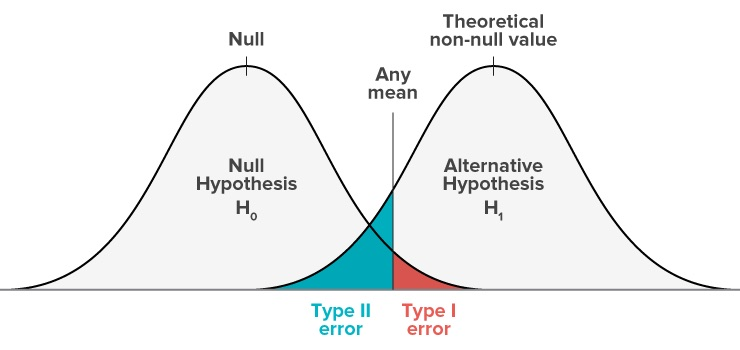

# Type I and Type II errors

Statistical tests are often thought of in terms of the errors they can generate.

The first error is where the test rejects a null hypothesis that is true. You find an effect where none exists. This is known as a **Type I error**, or false positive.

We set the rate at which Type I errors occur. The significance level $\alpha$ is the rate of Type I errors. If we use a significance level of 0.05, we have a 5% probability of rejecting the null hypothesis when it is true, generating a Type I error.

The second error is when we fail to reject a false null hypothesis. We do not find an effect where one exists. This is known as a **Type II error**, or false negative.

The Type II error rate is unknown, but can be calculated if we make a number of assumptions. We will examine this in the following pages. The type II error rate is denoted by $\beta$.

The relationship between these errors and correct inference is shown in the following table.

|                        | Null hypothesis ($H_0$) is true                       | Null hypothesis ($H_1$) is false                      |
|------------------------|------------------------|------------------------|
| **Don't reject** $H_0$ | True negative. Probability = $1-\alpha$               | Type II error (false negative). Probability = $\beta$ |
| **Reject** $H_0$       | Type I error (false positive). Probability = $\alpha$ | True positive. Probability = $1-\beta$                |

The following diagrams provide another view on these errors.

As per our running example, suppose we are estimating two sample means for how many people submit their tax return on time. We want to know whether the difference between them represents a true effect of the intervention. Let us suppose that the null hypothesis is true and there is no effect.

As we have discussed, the estimate of the effect is with error. Our estimate may vary from the true value. That estimate will fall within a probability distribution of mean $\mu$ and standard deviation $\frac{\sigma}{\sqrt{n}}$. The curve below represents that probability distribution.

When we set $\alpha=0.05$, we are setting a critical value such that there is a 0.05 chance that the estimate will be above the critical value, despite the null hypothesis being true. The red shaded area is the probability of type I error.

[For this version of the diagram, only show the bell curve on the left. Remove the curve on the right and the shaded green area. Change "Any mean" to "Critical value".]

Let us now assume there is an effect of our intervention. The alternative hypothesis is true.

Our estimate of this effect will again be with error, falling within a probability distribution of mean $\mu$ and standard deviation $\frac{\sigma}{\sqrt{n}}$, but this time with $\mu$ representing a positive effect. This is represented by the curve on the right.

As you can see in the diagram, there is a probability that even if the effect is true, the measured value of the effect will fall below the critical value. You will fail to reject the null even though the alternative hypothesis is true. The green shaded area represents this probability of a Type II error.

[Tweaks to make to diagram: change "Any mean" to "Critical value"; delete "Null" and "Theoretical non-null value" with $\bar{x}_1$]

Versions of diagram: 1. As in week 3.4 - normal distribution 2. As in week 3.5 - critical value 3. As here - version just null hypothesis curve 4. As here - version both curves 5. (for 4.3) Shifting H1 curve to the left or right - illustrate more/less chance of type II error if small/large effect size 6. (for 4.3) Larger sample size - reduce chance of type II error - bell curves getting taller and narrower, so green area shrinks 7. Trade-off between type 1 and 2 errors - changing significance level - slider??
